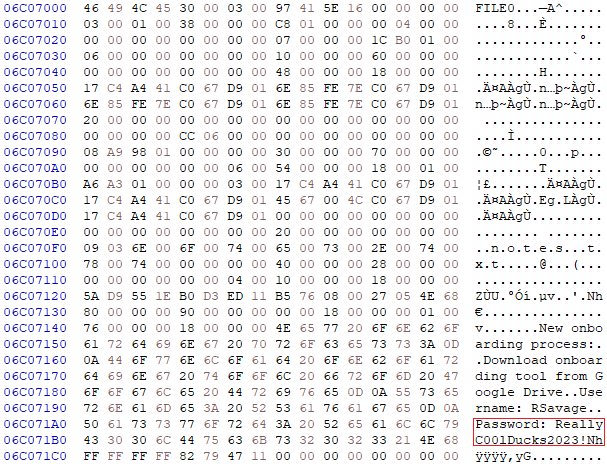

# **Descripción**

Este Sherlock se centra principalmente en el manejo de un archivo MFT, en el uso de distintos filtros y métodos para localizar e inspeccionar el contenido de los archivos dentro de la tabla.

---

## **Artefactos**

El archivo `mft.raw` es el único artefacto proporcionado por HTB para este lab.

---

## **Herramientas**

Las utilidades necesarias para la resolución son:

- [HxD](https://mh-nexus.de/en/hxd/)
- [MFTECmd](https://ericzimmerman.github.io/#!index.md)
- [Timeline Explorer](https://ericzimmerman.github.io/#!index.md)

---

# **Preguntas**

## **1. *What is the MD5 hash of the MFT?***

Para determinar el hash MD5 se utilizó el siguiente comando:

```
$ md5sum mft.raw
3730c2fedcdc3ecd9b83cbea08373226  mft.raw
```

El hash MD5 del archivo `mft.raw` es `3730c2fedcdc3ecd9b83cbea08373226`.

---

## **2. *What is the name of the only user on the system?***

Para poder explorar el archivo MFT con la herramienta `Timeline Explorer` de **Eric Zimmerman**, primero fue necesario realizar la conversión a un formato legible por el programa, el formato CSV.

Este proceso se realizó con otra utilidad del mismo autor llamada `MFTECmd`.

```
PS> .\MFTECmd.exe -f C:\Users\nezumigris\Desktop\hyperfiletable\mft.raw --csv C:\Users\nezumigris\Desktop\output --csvf mft.csv
MFTECmd version 1.3.0.0

Author: Eric Zimmerman (saericzimmerman@gmail.com)
https://github.com/EricZimmerman/MFTECmd

Command line: -f C:\Users\nezumigris\Desktop\hyperfiletable\mft.raw --csv C:\Users\nezumigris\Desktop\output --csvf mft.csv

Warning: Administrator privileges not found!

File type: Mft

Processed C:\Users\nezumigris\Desktop\hyperfiletable\mft.raw in 1.6966 seconds

C:\Users\nezumigris\Desktop\hyperfiletable\mft.raw: FILE records found: 110,818 (Free records: 7,240) File size: 115.5MB
        CSV output will be saved to C:\Users\nezumigris\Desktop\output\mft.csv
```

La pregunta hace referencia a un nombre de usuario, por lo que se aplicó el filtro `.\Users` en la columna `Parent Path`.


Con los siguientes filtros, se quitaron también las líneas que contenían `.\Users\Default` y `.\Users\Public`:


El único nombre de usuario que se encontró en el sistema es `Randy Savage`.

---

## **3. *What is the name of the malicious HTA that was downloaded by that user?***

Se localizó el archivo HTA con los siguientes filtros:


El HTA malicioso que descargó el usuario es `Onboarding.hta`.

---

## **4. *What is the ZoneId of the download for the malicious HTA file?***

El archivo con extensión `.Identifier` se localizó utilizando el nombre del archivo descargado como filtro.


En la columna `Zone Id Contents` se puede observar la información relacionada con la descarga.


El `ZoneID` del HTA malicioso es `3`.

---

## **5. *What is the download URL for the malicious HTA?***

Como en la pregunta anterior, la URL se encuentra en la columna `Zone Id Contents`.


La URL de donde se descargó el HTA malicioso es `https://doc-10-8k-docs.googleusercontent.com/docs/securesc/9p3kedtu9rd1pnhecjfevm1clqmh1kc1/9mob6oj9jdbq89eegoedo0c9f3fpmrnj/1680708975000/04991425918988780232/11676194732725945250Z/1hsQhtmZJW9xZGgniME93H3mXZIV4OKgX?e=download&uuid=56e1ab75-ea1e-41b7-bf92-9432cfa8b645&nonce=u98832u1r35me&user=11676194732725945250Z&hash=j5meb42cqr57pa0ef411ja1k70jkgphq`.

---

## **6. *What is the allocated size for the HTA file? (bytes)***

El peso asignado no se puede ver directamente desde `Timeline Explorer`, pero si con la herramienta `MFTECmd`.

Primero fue necesario obtener el número de entrada del archivo `Onboarding.hta` desde `Timeline Explorer`.


Teniendo el número de entrada, con el siguiente comando se listó la información disponible en el archivo MFT:

```
PS> .\MFTECmd.exe -f C:\Users\nezumigris\Desktop\hyperfiletable\mft.raw --de 103820
...
**** DATA ****
  Attribute #: 0x4, Size: 0x48, Content size: 0x0, Name size: 0x0, ContentOffset 0x0. Resident: False

  Non-Resident Data
  Starting Virtual Cluster #: 0x0, Ending Virtual Cluster #: 0x0, Allocated Size: 0x1000, Actual Size: 0x478, Initialized Size: 0x478

  DataRuns Entries (Cluster offset -> # of clusters)
  0x14B1F6                         ->      0x1
...
```

> El *output* del comando está recortado para mostrar solo lo relevante.

El peso asignado del archivo HTA es `0x1000` en formato hexadecimal.

Este valor de convirtió a su formato decimal con el comando:

```
$ printf '%d\n' 0x1000
4096
```

El peso asignado del archivo `Onboarding.hta` es de `4096` bytes.

---

## **7. *What is the real size of the HTA file? (bytes)***

El peso real del archivo HTA se obtuvo con el mismo proceso realizado en la pregunta anterior.

```
PS> .\MFTECmd.exe -f C:\Users\nezumigris\Desktop\hyperfiletable\mft.raw --de 103820
...
**** DATA ****
  Attribute #: 0x4, Size: 0x48, Content size: 0x0, Name size: 0x0, ContentOffset 0x0. Resident: False

  Non-Resident Data
  Starting Virtual Cluster #: 0x0, Ending Virtual Cluster #: 0x0, Allocated Size: 0x1000, Actual Size: 0x478, Initialized Size: 0x478

  DataRuns Entries (Cluster offset -> # of clusters)
  0x14B1F6                         ->      0x1
...
```

En este caso el peso real está representado como peso actual.

```
$ printf '%d\n' 0x478
1144
```

El peso real del HTA es de `1144` bytes.

---

## **8. *When was the powerpoint presentation downloaded by the user?***

Para localizar el archivo descargado, se filtró por la extensión `.pptx`, que corresponde con la extensión predeterminada de PowerPoint.


La fecha de creación del archivo se encuentra en la columna `Created0x10`.


El usuario descargó la presentación de PowerPoint el `05/04/2023 13:11:49`.

---

## **9. *The user has made notes of their work credentials, what is their password?***

Se localizó el archivo de texto en el mismo directorio en el que se encontraba la presentación de PowerPoint.


Para poder inspeccionar el contenido de un archivo, este debe ser un archivo residente. Por defecto, en los sistemas NTFS los archivos deben de pesar como máximo 1024 bytes (metadatos incluidos) para que se almacenen directamente en el MFT.

El archivo `notes.txt` pesaba significativamente menos que 1024 bytes, por lo que era muy probable que su contenido se encontrara en el MFT.


Para localizar el inicio de un archivo en `HxD` es necesario un *offset*. Este valor se calcula utilizando el número de entrada de un registro por el tamaño del mismo registro:


```
110620 * 1024 = 113274880
```

Para saltar directamente al inicio del archivo se utilizó la funcionalidad `Go to` de `HxD`.




La contraseña que guardó el usuario en una nota es `ReallyC00lDucks2023!`.

---

## **10. *How many files remain under the C:\Users\ directory? (Recursively)***

Para poder determinar cuantos archivos se encontraban en la ruta `C:\Users` se utilizaron los siguientes filtros:


Existen `3471` archivos en la ruta `C:\Users`.
