# Punto de apoyo inicial

Para comenzar con el análisis y tener un punto de apoyo inicial, se utilizó la herramienta NetworkMiner, esta utilidad permite ver los archivos que fueron transferidos a través de la red desde la pestaña `Files`.

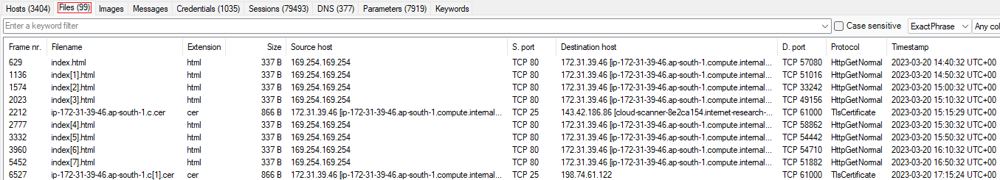

Tres de estos archivos se diferencian del resto por sus nombres y porque no comparten las extensiones comunes de los demás archivos. Estos archivos son `backup`, `fetch.sh` y `Ransomware2_server.zip`.

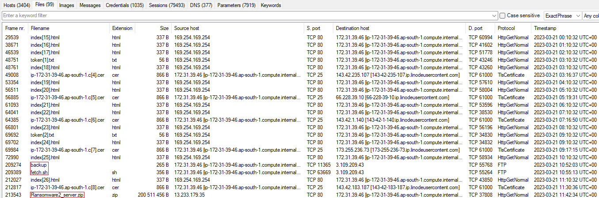

Estos archivos se pueden abrir directamente desde la herramienta haciendo click derecho y luego `Open`, o en el caso del archivo comprimido, abrir el directorio en donde se encuentra.

- `backup`

Este archivo tiene la configuración de una técnica llamada **Port Knocking**. Teniendo en cuenta la configuración, si en el transcurso de 5 segundos se envía un paquete SYN a los puertos `29999`, `50234` y `45087` en ese orden, se abrirá el puerto `24456` y permitirá cualquier conexión por TCP.

```
[options]
	UseSyslog

[FTP-INTERNAL]
	sequence    = 29999,50234,45087
	seq_timeout = 5
	command     = /sbin/iptables -I INPUT -s %IP% -p tcp --dport 24456 -j ACCEPT
	tcpflags    = syn


# Creds for the other backup server abdullah.yasin:XhlhGame_90HJLDASxfd&hoooad
```

Al final del archivo también se encuentra un comentario con las credenciales `abdullah.yasin:XhlhGame_90HJLDASxfd&hoooad`.

- `fetch.sh`

El archivo `fetch.sh` es un script de Bash que tiene definida varias variables que luego utiliza para realizar una consulta SQL.

```bash
#!/bin/bash

# Define variables
DB_HOST="3.13.65.234"
DB_PORT="3306"
DB_USER="tony.shephard"
DB_PASSWORD="GameOfthronesRocks7865!"
DB_NAME="Internal_Tasks"
QUERY="SELECT * FROM Tasks;"

# Execute query and store result in a variable
RESULT=$(mysql -h $DB_HOST -P $DB_PORT -u $DB_USER -p$DB_PASSWORD $DB_NAME -e "$QUERY")

# Print the result
echo "$RESULT"
```

De entre las variables definidas se exponen las credenciales `tony.shephard:GameOfthronesRocks7865!`.

- `Ransomware2_server.zip`

Este archivo ZIP contiene un repositorio de GitHub. El `README.md` de este repositorio en parte dice lo siguiente:

```
# GonnaCry Rasomware

Original Repository of the GonnaCry Ransomware.

GonnaCry is a linux ransomware that encrypts all the user files with a strong encryption scheme.

This project is OpenSource, feel free to use, study and/or send pull request.

...
```

El texto hace referencia al ransomware `GonnaCry`.

NetworkMiner guardó el comprimido en la siguiente ruta:

```
...\13.233.179.35\TCP-80\PKCampaign\Targets\Forela\Ransomware2_server.zip
```

Al modificar la ruta, queda la petición web `http://13.233.179.35/PKCampaign/Targets/Forela/Ransomware2_server.zip`.

---

# IP de los archivos

Para determinar que dirección IP analizar primero se utilizaron los timestamp de los archivos.

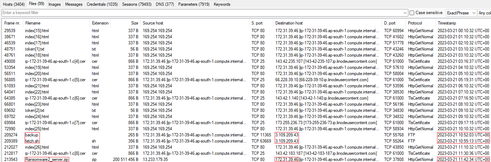

La siguiente tabla representa estos datos de forma ordenada:

| **Fecha y hora (UTC)** | **Archivo**              | **Dirección IP de origen** | **Dirección IP de destino** |
| ---------------------- | ------------------------ | -------------------------- | --------------------------- |
| 2023/03/21 10:52:03    | `backup`                 | 172.31.39.46 (Forela)      | 3.109.209.43                |
| 2023/03/21 10:55:13    | `fetch.sh`               | 172.31.39.46 (Forela)      | 3.109.209.43                |
| 2023/03/21 11:42:34    | `Ransomware2_server.zip` | 13.233.179.35              | 172.31.39.46 (Forela)       |

---

# Escaneo de puertos

Luego de obtener un punto de apoyo, para analizar el tráfico de red de forma más minuciosa se utilizó Wireshark.

Teniendo en cuenta la IP `3.109.209.43`, el primer filtro que se aplicó fue `ip.addr == 3.109.209.43`.

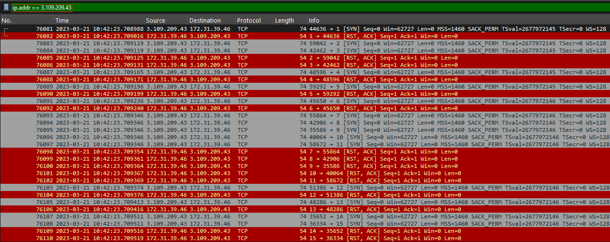

En la imagen anterior se puede observar como la IP `3.109.209.43` esta realizando un escaneo de puertos.

Para ver los paquetes relacionados con el escaneo se utilizó el filtro `ip.src == 3.109.209.43 && tcp.flags.syn == 1 && tcp.flags.ack == 0 && tcp.len == 0`.

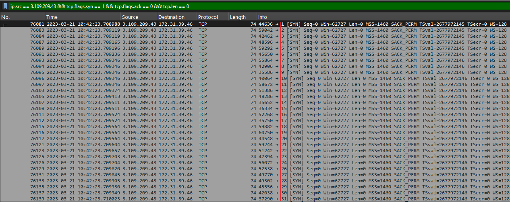

El primer paquete SYN del escaneo se envió a las `10:42:23` y el último a las `10:42:26`, ambos en la fecha `21/03/2023`. El escaneo se realizó sobre los `65535` puertos.

Con el filtro `ip.dst == 3.109.209.43 && tcp.flags.syn == 1 && tcp.flags.ack == 1 && tcp.len == 0`, se determinó que puertos se detectaron como abiertos.

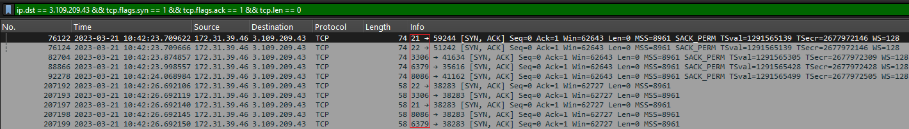

Los puertos que enviaron respuesta SYN-ACK fueron `21,22,3306,6379,8086`.

---

# Password Spraying

Debajo de los paquetes relacionados con el escaneo de puertos, se encontraron varias respuestas por parte de servidor FTP. De forma predeterminada el puerto 21 corresponde con este servicio.

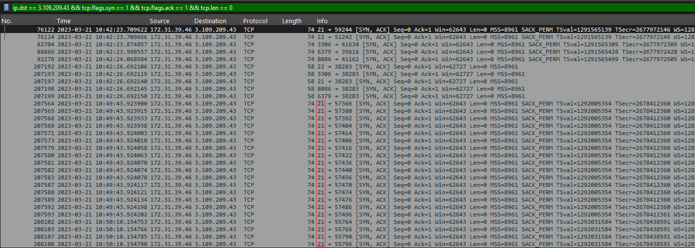

Nuevamente se listaron los paquetes relacionados con la IP `3.109.209.43` pero teniendo en cuenta el servicio FTP. El filtro utilizado fue `ip.addr == 3.109.209.43 && ftp`.

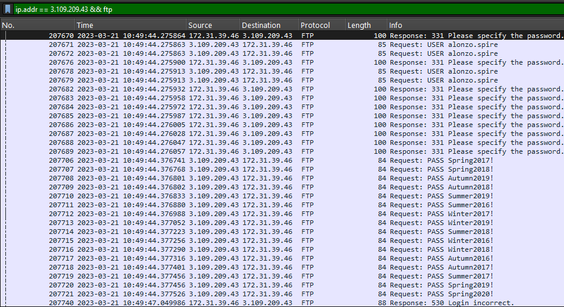

Considerando los paquetes listados se puede inferir un Password Spraying.

El **Password Spraying** básicamente consiste en probar unas pocas contraseñas comunes contra multiples cuentas de usuarios. En MITRE ATT&CK el ID correspondiente es el [T1110.003](https://attack.mitre.org/techniques/T1110/003/).

El paquete número `208838` muestra que el ataque tuvo éxito y se inicio sesión en el servicio.

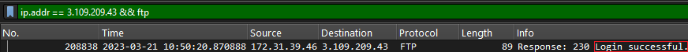

Las credenciales que se validaron correctamente fueron `tony.shephard:Summer2023!`.

```
220 (vsFTPd 3.0.5)
USER tony.shephard
331 Please specify the password.
PASS Summer2023!
230 Login successful.
```

Luego de que este ataque automatizado validara las credenciales, el atacante inicio sesión de forma manual.

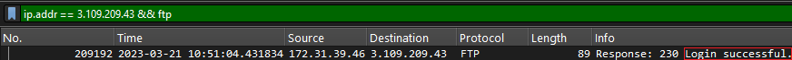

En la siguiente imagen se muestran parte de los comandos ejecutados.

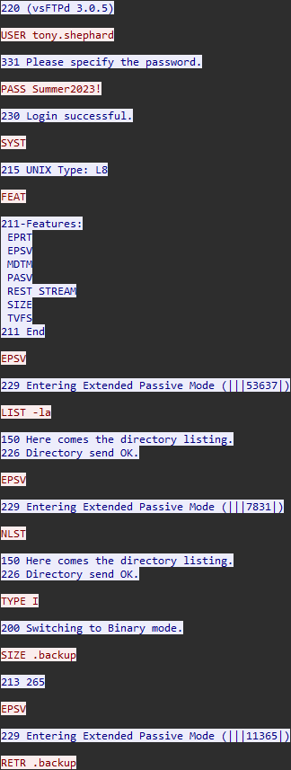

El atacante descargo dos archivos, estos son

- `.backup`.
- `fetch.sh`.

A excepción del archivo `Ransomware2_server.zip`, los archivos anteriores ya se vieron en el punto de apoyo inicial.

---

# Port Knocking

Retomando con el archivo `.backup`, este tiene la configuración de un Port Knocking.

Considerando la configuración de la técnica, el orden de los puertos a los que hay que enviar las señales es `29999,50234,45087`.

```
[options]
	UseSyslog

[FTP-INTERNAL]
	sequence    = 29999,50234,45087
	seq_timeout = 5
	command     = /sbin/iptables -I INPUT -s %IP% -p tcp --dport 24456 -j ACCEPT
	tcpflags    = syn


# Creds for the other backup server abdullah.yasin:XhlhGame_90HJLDASxfd&hoooad
```

Para ver los paquetes relacionados con el Port Knocking se utilizó el filtro `ip.addr == 3.109.209.43 && tcp.flags.syn == 1 && tcp.len == 0`.

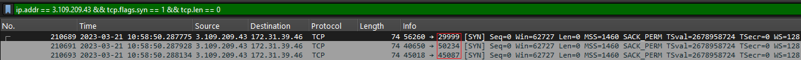

Los tres puertos recibieron la señal por parte del atacante a las `10:58:50`.

El servicio que corría por el puerto `24456` era el servicio FTP. El atacante inicio sesión en el servicio con las credenciales `abdullah.yasin:XhlhGame_90HJLDASxfd&hoooad` en la hora `11:00:01`.

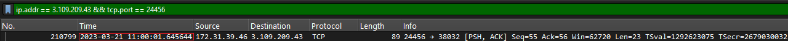

Los comandos ejecutados fueron:

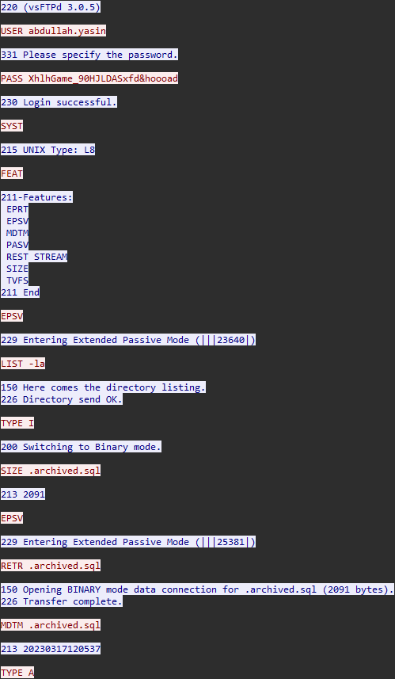

Como pasó anteriormente con el servicio FTP, el atacante descargó varios archivos del servidor.

Para el análisis es importante tener en cuenta el puerto de transferencia, ya que con este puerto se puede ver el contenido de cada archivo a través de Wireshark con el filtro `ip.addr == 3.109.209.43 && tcp.port == <PORT>`.

- `.archived.sql`

El puerto de transferencia fue el `25381`.

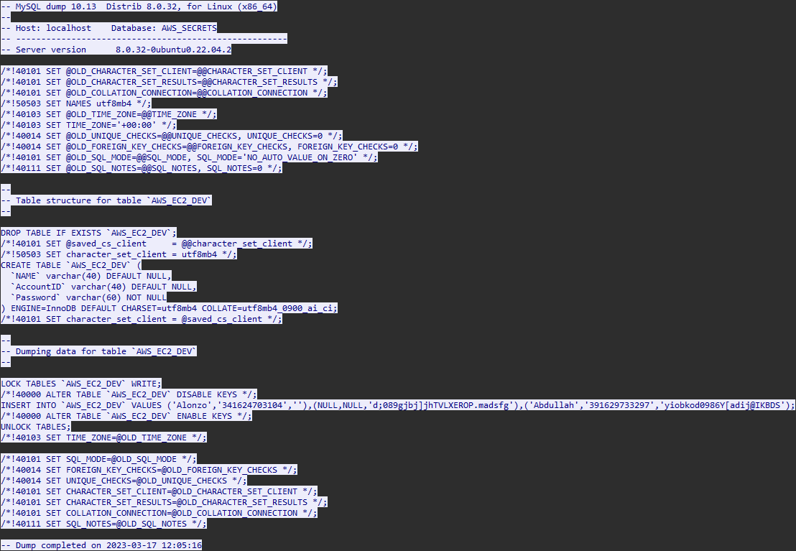

- `Tasks to get Done.docx`

El puerto de transferencia fue el `27862`.

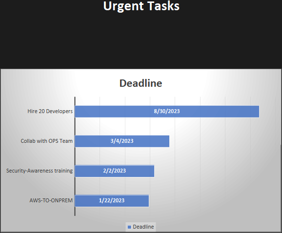

- `reminder.txt`

El puerto de transferencia fue el `5488`.

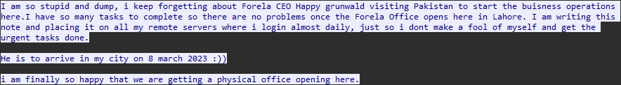

- `/etc/passwd`

El puerto de transferencia fue el `19174`.

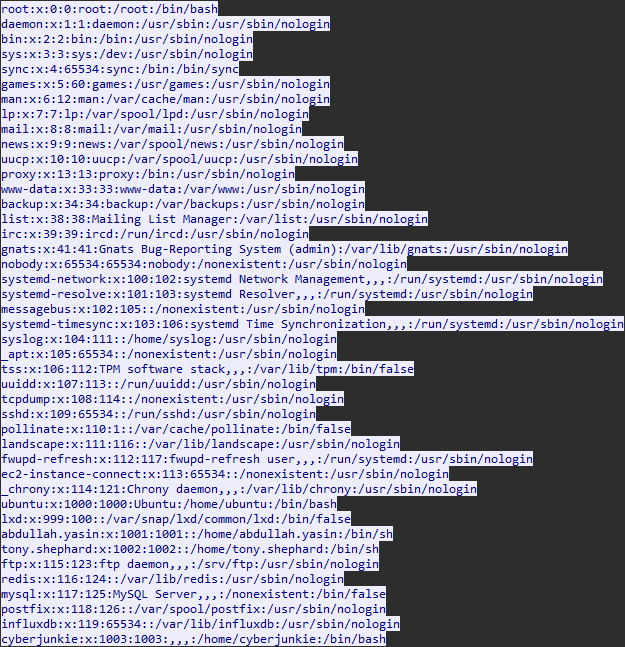

- `/opt/reminders/.reminder`

El puerto de transferencia fue el `44249`.


---

# Credenciales expuestas en GitHub

El mensaje del archivo `.reminder` menciona un repositorio de GitHub.

Luego de buscar por la cadena "Forela", se encontró con el siguiente [repositorio](https://github.com/forela-finance/forela-dev), que tiene como usuario `CyberJunnkie`:

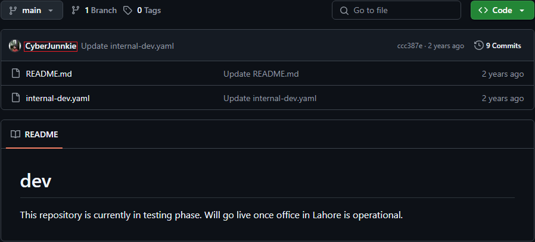

Como se observa en la imagen, este repositorio tiene nueve commits.

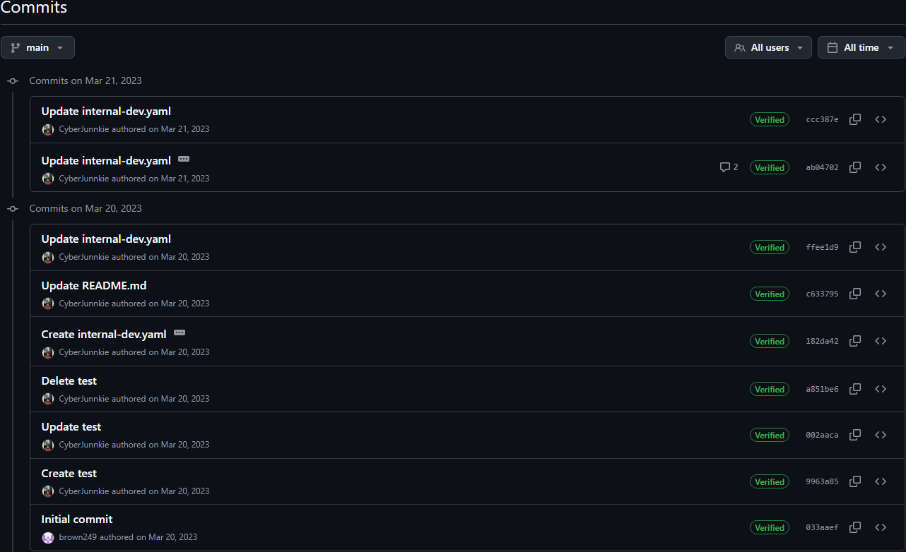

El commit con mensaje `Updated the script to be more secure...`, expone credenciales de acceso por SSH.

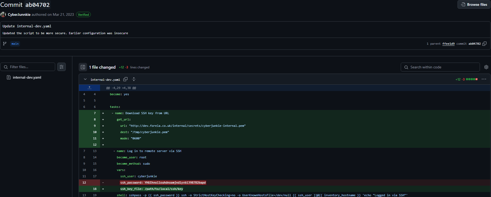

---

# Cabeceras HTTP

Por último y retomando con el archivo `Ransomware2_server.zip` que se descubrió con NetworkMiner, el servidor que alojaba el archivo tenia como dirección IP `13.233.179.35`.

Se utilizó el filtro `ip.addr == 13.233.179.35 && http` para listar los paquetes HTTP.

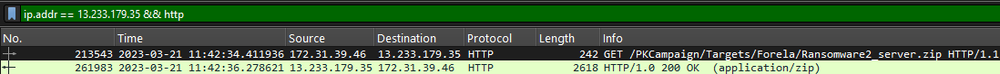

Dentro de la petición GET, se pueden ver las cabeceras HTTP.

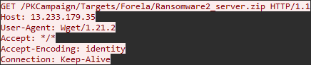

La URL utilizada fue la misma que se mostró anteriormente, y el archivo fue descargado utilizando `wget`.

---

# Preguntas y respuestas

1. **Which ports did the attacker find open during their enumeration phase?**
    - `21,22,3306,6379,8086` ([Escaneo de puertos](#escaneo-de-puertos))
2. **Whats the UTC time when attacker started their attack against the server?**
    - `21/03/2023 10:42:23` ([Escaneo de puertos](#escaneo-de-puertos))
3. **What's the MITRE Technique ID of the technique attacker used to get initial access?**
    - `T1110.003` ([Password Spraying](#password-spraying))
4. **What are valid set of credentials used to get initial foothold?** `tony.shephard:Summer2023!`
    - ([Password Spraying](#password-spraying))
5. **What is the Malicious IP address utilized by the attacker for initial access?**
    - `3.109.209.43` ([Password Spraying](#password-spraying))
6. **What is name of the file which contained some config data and credentials?**
    - `.backup` ([Punto de apoyo inicial](#punto-de-apoyo-inicial))
7. **Which port was the critical service running?**
    - `24456` ([Port Knocking](#port-knocking))
8. **Whats the name of technique used to get to that critical service?**
    - `Port Knocking` ([Port Knocking](#port-knocking))
9. **Which ports were required to interact with to reach the critical service?**
    - `29999,45087,50234` ([Port Knocking](#port-knocking))
10. **Whats the UTC time when interaction with previous question ports ended?**
    - `21/03/2023 10:58:50` ([Port Knocking](#port-knocking))
11. **What are set of valid credentials for the critical service?**
    - `abdullah.yasin:XhlhGame_90HJLDASxfd&hoooad` ([Port Knocking](#port-knocking))
12. **At what UTC Time attacker got access to the critical server?**
    - `21/03/2023 11:00:01` ([Port Knocking](#port-knocking))
13. **Whats the AWS AccountID and Password for the developer "Abdullah"?**
    - `391629733297:yiobkod0986Y[adij@IKBDS` ([Port Knocking](#port-knocking))
14. **Whats the deadline for hiring developers for forela?**
    - `30/08/2023` ([Port Knocking](#port-knocking))
15. **When did CEO of forela was scheduled to arrive in pakistan?**
    - `08/03/2023` ([Port Knocking](#port-knocking))
16. **The attacker was able to perform directory traversel and escape the chroot jail.This caused attacker to roam around the filesystem just like a normal user would. Whats the username of an account other than root having /bin/bash set as default shell?**
    - `cyberjunkie` ([Port Knocking](#port-knocking))
17. **Whats the full path of the file which lead to ssh access of the server by attacker?**
    - `/opt/reminders/.reminder` ([Port Knocking](#port-knocking))
18. **Whats the SSH password which attacker used to access the server and get full access?**
    - `YHUIhnollouhdnoamjndlyvbl398782bapd` ([Credenciales expuestas en GitHub](#credenciales-expuestas-en-github))
19. **Whats the full url from where attacker downloaded ransomware?**
    - `http://13.233.179.35/PKCampaign/Targets/Forela/Ransomware2_server.zip` ([Punto de apoyo inicial](#punto-de-apoyo-inicial))
20. **Whats the tool/util name and version which attacker used to download ransomware?**
    - `Wget/1.21.2` ([Cabeceras HTTP](#cabeceras-http))
21. **Whats the ransomware name?**
    - `GonnaCry` ([Punto de apoyo inicial](#punto-de-apoyo-inicial))
